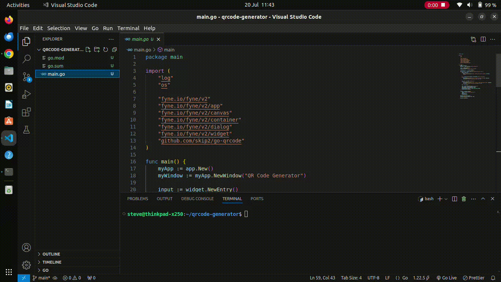

# QR Code Generator

## Screenshots
Here is a GIF demonstrating the QR Code Generator in action:



## Features
 - Input text to encode into a QR code
 - Generate and display QR code in the application
 - Save QR code as an image file (`qrcode.png`)

# Installation
## Prerequisites
Ensure you have Go installed on your system. You can download it from the [official Go website](https://golang.org/dl/).

## Clone the Repository
Clone this repository to your local machine:

    ```bash
    git clone [https://github.com/yourusername/qrcode-generator.git](https://github.com/MuxN4/QR-Code-Generator.git)
    cd qrcode-generator
    ```

## Install Dependencies
Install the required Go packages:

    bash
    go get -u github.com/skip2/go-qrcode
    go get fyne.io/fyne/v2

# Usage
Run the Application:

Execute the following command to start the QR Code Generator:

    ```bash
    go run main.go
    ```

## Generate a QR Code:

 - Enter the text you want to encode in the input field.
 - Click the "Generate QR Code" button.
 - The QR code will be displayed in the application window and saved as `qrcode.png` in the project directory.

## Acknowledgments
 - Go - The programming language used
 - Fyne - GUI toolkit used for the application
 - go-qrcode - QR code generation library

